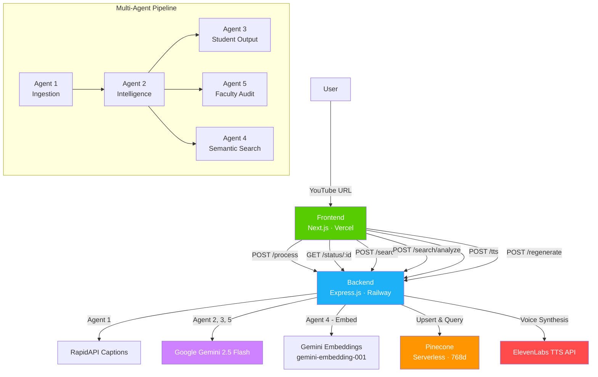

# 🦊 LectureAI

> Turn any YouTube lecture into a complete study environment in 60 seconds.

**Cloudforce "No Resume Required" Hackathon — May 2026**

---

## What It Does

Paste a YouTube lecture URL. LectureAI's multi-agent AI pipeline extracts the transcript, analyzes the pedagogical structure, and generates:

**Student Mode:**
- 📝 Hierarchical outline with clickable timestamps
- 📖 Multi-depth summaries (90 sec / 5 min / Full)
- 🃏 Active-recall flashcards linked to lecture moments
- 🔍 Semantic search with AI-powered explanations
- 🌐 Bilingual support (Spanish, French, Mandarin, Arabic, Portuguese, Hindi)
- 🔊 Fox mascot voice narration (ElevenLabs TTS)

**Faculty Mode:**
- 📊 Overall pedagogical quality score (0–100)
- 🎯 Top priority improvement with timestamp
- 📈 Four-dimension audit: Clarity, Accessibility, Equity, Pacing
- 🕐 Timestamped coaching suggestions

---

## Architecture



---

## Tech Stack

| Layer | Technology | Purpose |
|-------|-----------|---------|
| Frontend | Next.js 16 (App Router) | Duolingo-inspired UI with Fox mascot |
| Backend | Express.js | Multi-agent orchestration & API |
| LLM | Google Gemini 2.5 Flash | Content analysis & material generation |
| Embeddings | Gemini Embeddings API (`gemini-embedding-001`) | 768-dim vectors for semantic search |
| Vector DB | Pinecone (Serverless) | Namespace-isolated lecture indexing |
| TTS | ElevenLabs | Fox mascot voice narration |
| Transcript | RapidAPI (WebVTT captions) | Caption extraction with timestamps |
| Styling | Tailwind CSS v4 | Custom Duolingo design system |

---

## The Five Agents

| # | Agent | Input | Output |
|---|-------|-------|--------|
| 1 | **Ingestion** | YouTube URL | Transcript + metadata + segments |
| 2 | **Intelligence** | Transcript | Topic analysis + pedagogical signals + chunks |
| 3 | **Student Output** | Intelligence data + language | Outline, summaries, flashcards |
| 4 | **Semantic Search** | Query + videoId | Relevant moments + AI explanations |
| 5 | **Faculty Audit** | Intelligence data + transcript | Scores, findings, coaching suggestions |

---

## Getting Started

### Prerequisites
- Node.js 18+
- Google Gemini API key
- Pinecone account (free tier works)
- RapidAPI key (for YouTube captions)
- ElevenLabs API key (optional, for voice)

### Setup

```bash
# Clone the repo
git clone https://github.com/yourusername/LectureAI.git
cd LectureAI

# Install all dependencies
npm run install-all

# Configure environment
cp backend/.env.example backend/.env
# Fill in your API keys in backend/.env
```

### Environment Variables (`backend/.env`)

```
GEMINI_API_KEY=your_gemini_key
PINECONE_API_KEY=your_pinecone_key
PINECONE_INDEX_NAME=lecture-ai
X_RAPIDAPI_KEY=your_rapidapi_key
FRONTEND_URL=http://localhost:3000
PORT=3001
ELEVENLABS_API_KEY=your_elevenlabs_key    # Optional
ELEVENLABS_VOICE_ID=your_voice_id          # Optional
```

### Run Locally

```bash
# Terminal 1: Backend
cd backend && npm run dev

# Terminal 2: Frontend
cd frontend && npm run dev
```

Open [http://localhost:3000](http://localhost:3000)

---

## Design Philosophy

We modeled the UX after **Duolingo** — the most successful learning platform in the world. Key design decisions:

- **Fox Mascot**: A friendly guide that speaks to you during processing and explains search results
- **3D Button Affordances**: Chunky, tactile buttons inspired by Duolingo's game-like interface
- **Feather Green Design System**: Vibrant `#58CC02` green with high-contrast accessibility
- **Mini-Game**: A Fox Runner game keeps users engaged during the 30-60 second processing wait
- **Voice Narration**: ElevenLabs TTS makes the Fox mascot feel alive, not just decorative

---

## Key Technical Decisions

1. **Gemini Embeddings API**: We use Google's `gemini-embedding-001` model (768 dimensions) for vector generation. This keeps the stack unified under one API key and provides high-quality embeddings for per-video scoped search.

2. **Pinecone Namespaces**: Each video gets its own namespace. Before indexing, we wipe the namespace clean. This guarantees zero data leakage between lectures.

3. **Async Job Pipeline**: Processing happens asynchronously via an in-memory job store. The frontend polls `/status/:jobId` every 2 seconds for live progress updates.

4. **One-Call LLM Strategy**: Each agent makes a single Gemini call with a comprehensive prompt rather than multiple smaller calls. This minimizes latency and API costs.

---

## Project Structure

```
LectureAI/
├── frontend/                  # Next.js (Vercel)
│   ├── app/
│   │   ├── page.tsx           # Landing page
│   │   ├── processing/        # Loading state with Fox game
│   │   ├── dashboard/[jobId]/ # Student study environment
│   │   └── audit/[jobId]/     # Faculty audit report
│   ├── components/
│   │   ├── fox-mascot.tsx     # Animated Fox with expressions
│   │   └── fox-game.tsx       # Canvas mini-game
│   └── lib/
│       └── api.ts             # Backend API wrappers
│
├── backend/                   # Express.js (Railway)
│   ├── agents/
│   │   ├── ingestionAgent.js  # YouTube → transcript
│   │   ├── intelligenceAgent.js # Transcript → analysis
│   │   ├── studentAgent.js    # Analysis → study materials
│   │   ├── facultyAgent.js    # Analysis → audit report
│   │   └── searchAgent.js     # Query → relevant moments
│   ├── lib/
│   │   ├── gemini.js          # Gemini LLM + embeddings API
│   │   ├── pinecone.js        # Vector DB with namespaces
│   │   ├── tts.js             # ElevenLabs TTS
│   │   └── jobStore.js        # In-memory job state
│   └── routes/
│       ├── process.js         # POST /process
│       ├── status.js          # GET /status/:jobId
│       ├── search.js          # POST /search + /search/analyze
│       ├── regenerate.js      # POST /regenerate
│       └── tts.js             # POST /tts
│
└── package.json               # Monorepo workspaces
```

---

## License

MIT
